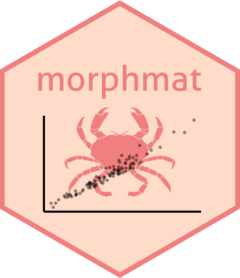

# morphmat



<!-- badges: start -->

[](https://lifecycle.r-lib.org/articles/stages.html#experimental)
[](https://www.repostatus.org/#wip)
<!-- badges: end -->

A compilation of methods used to estimate size at (sexual) maturity
based on morphometric data, most commonly applied to crabs, lobsters,
and other crustaceans. Approaches include modeling approaches based on
piecewise/segmented linear regression as well as numerous
clustering-based methods.

## Installation

You can install the development version of morphmat from
[GitHub](https://github.com/) with:

``` r
# install.packages("devtools")
devtools::install_github("rmk118/morphmat")
```

## Example

This is a basic example which shows you how to solve a common problem:

``` r
# library(morphmat)
## basic example code
```
